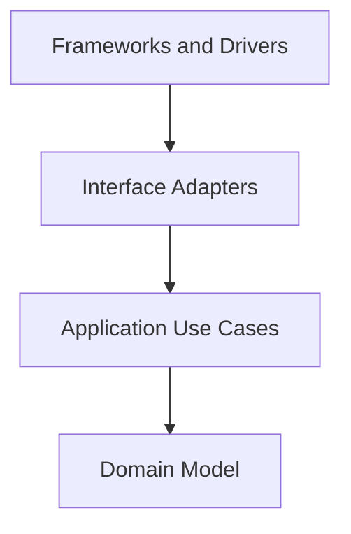

# XClient Architecture Spec

本文件定義 xclient project 的架構開發原則，適用於所有開發人員與 AI
agent。

本 project 採用 Clean Architecture 作為主要架構原則。實作時必須讓
xclient 的 domain model 與 application use cases 獨立於 CLI framework、
HTTP client、OpenAI-compatible SDK/client、config loading、terminal I/O、
logging backend 與部署細節。

本文整理自 [The Clean Architecture](https://blog.cleancoder.com/uncle-bob/2012/08/13/the-clean-architecture.html)，
並搭配 xclient Python 規範 [`coding-style.md`](coding-style.md) 使用。

## 核心目標

本 project 的設計必須滿足以下目標：

- Separation of concerns：CLI 命令、使用者輸入、application flow、domain rule、API mapping 與 framework wiring 必須分開。
- Independent of frameworks：CLI framework、HTTP client、config parser、terminal renderer 與第三方 SDK 是工具，不是核心規則的中心。
- Testable：domain model 與 use case 必須能在不啟動 terminal、network、HTTP client、config file、credential store 或外部 API 的情況下測試。
- Independent of CLI details：command name、option parsing、stdout/stderr、exit code、terminal color 與 progress UI 不得影響內層規則。
- Independent of external agencies：內層邏輯不應知道 provider API response shape、HTTP status、streaming transport、filesystem、environment variable 或第三方 SDK object 的細節。

## Dependency Rule

Clean Architecture 最重要的規則是 Dependency Rule：source code
dependencies 只能指向內層。



依賴方向代表：

- 外層可以知道內層。
- 內層不得 import、引用、命名或依賴外層。
- Domain model 與 application use case 不得 import CLI framework、HTTP client、SDK、config loader、terminal renderer、filesystem adapter 或 infrastructure module。
- 內層不得接受外層 framework 的資料型別，例如 `click.Context`、`argparse.Namespace`、`httpx.Response`、raw API response dict、config parser object、environment variable mapping 或 SDK object。
- 外層變更不應迫使內層 domain rule 或 use case contract 變更。

若流程控制需要由內層觸發外層能力，必須使用依賴反轉：內層定義需要
的 port/protocol，外層提供實作。

## 建議層次

實際目錄名稱可依專案演進調整，但責任邊界必須清楚。

### Domain Model

Domain model 是最內層，負責 xclient 需要表達的核心概念與穩定規則。

Domain model 可以包含：

- Domain type、value object、entity-like data structure。
- 不依賴 CLI、network、filesystem 或外部 API 即可執行的規則。
- 狀態轉換、資料一致性規則、輸入正規化或分類規則。
- 與 glossary/API contract 對齊的 ubiquitous language。

Domain model 不得包含：

- CLI command、option parser、terminal output、progress renderer。
- HTTP request/response shape、provider API DTO、SDK object。
- Config file path、environment variable name、credential store key。
- Framework lifecycle、filesystem side effect 或部署設定。

### Application Use Cases

Application use cases 描述 xclient 特定的使用者目標與應用流程，負責協調
domain model 與 ports。

Use cases 可以包含：

- Query/command service。
- 將 CLI 使用者意圖轉成 application operation 的流程。
- API gateway、credential store、config repository、clock、stream sink、token counter 等 port/protocol 定義。
- Loading、success、failure、retryable failure、cancellation 等可測試的 application state transition。

Use cases 不得包含：

- CLI framework callback、option parsing、stdout/stderr 寫入或 terminal styling。
- 具體 HTTP client、SDK call、config parser、filesystem access 或 environment lookup。
- Provider 原始 response shape、transport protocol detail 或 terminal display format。

### Interface Adapters

Interface adapters 負責轉換內層與外層之間的資料格式。

Interface adapters 可以包含：

- CLI command adapter、presenter、output formatter。
- API DTO 與 domain/application model 之間的 mapper。
- 將 command arguments、options、config values、environment values 或 raw API response 轉成 use case input/result 的轉換邏輯。
- Port implementation 的薄型 adapter，例如 API repository、credential store adapter、config adapter 或 stream adapter。

Interface adapters 必須避免把外層格式直接傳入 use case 或 domain model。

### Frameworks and Drivers

Frameworks and drivers 是最外層，負責具體工具與執行環境。

這一層可以包含：

- CLI framework bootstrap、entry point、command registration。
- HTTP client、OpenAI-compatible SDK/client、streaming transport。
- Config loading、environment variable access、filesystem、credential storage。
- Terminal renderer、logging backend、metrics exporter、process signal handling。

外層程式碼應保持薄，主要負責 wiring、configuration、I/O 與 glue code。

## XClient 目錄建議

未來新增功能時，目錄可依責任分層演進。名稱可調整，但不得模糊責任
邊界。

```text
src/
  domain/          # 內層：domain model、value object、純規則
  application/     # 內層：use cases、ports、application state transition
  adapters/        # 外層：DTO mapper、presenter、port implementation
  cli/             # 外層：CLI commands、option parsing、terminal output
  infrastructure/  # 最外層：HTTP/config/credential/filesystem/framework wiring
```

目錄規則：

- `domain/` 不得 import `application/`、`adapters/`、`cli/` 或 `infrastructure/`。
- `application/` 可 import `domain/`，不得 import `adapters/`、`cli/` 或 `infrastructure/`。
- `adapters/` 可 import `application/` 與 `domain/`，負責格式轉換與 port 實作。
- `cli/` 可 import use case、adapter、presenter 與 domain type，但不得把 CLI framework 型別傳入內層。
- `infrastructure/` 可知道所有外層工具，並在 composition root 完成 wiring。

若功能尚小，可以先用較少目錄，但新增程式碼時仍必須能指出它所屬的
Clean Architecture 層次。

## 資料穿越邊界

跨層傳遞資料時，資料格式必須以內層最容易理解與維護的形式為準。

- 進入 use case 前，CLI arguments、options、config values、environment values、raw API response、stream chunks 必須先轉成內層 input model 或簡單 value。
- Use case 回傳給 CLI 時，應回傳 application result model 或簡單 value，再由 presenter/formatter 轉成 stdout、stderr、exit code 或 terminal display。
- 不得把 `click.Context`、`argparse.Namespace`、`httpx.Response`、raw API response dict、config parser object、SDK object 或 filesystem handle 傳入 domain/use case。
- 跨邊界資料應使用清楚、穩定、低耦合的 dataclass、TypedDict、protocol-friendly value、primitive value 或明確 domain type。

```python
from dataclasses import dataclass


@dataclass(frozen=True)
class CreateChatCompletionInput:
    """Application input after CLI and config values are validated."""

    model: str
    messages: tuple[ChatMessage, ...]
    stream: bool


# Bad: use case depends on CLI and transport details.
def create_chat_completion(context: click.Context, response: httpx.Response) -> None:
    ...
```

API DTO、config row 與 domain/application model 不應共用同一個 type，除非
該 type 已被明確定義為穩定 published language，且文件說明其跨邊界
語意。

## Ports 與依賴反轉

Protocol 是用來保護內層規則，不是用來裝飾每個 class/dataclass。

- Port/protocol 應由使用端定義，描述 use case 真正需要的能力。
- Port 應保持小而明確，避免把 HTTP client、SDK、config parser、filesystem 或 terminal renderer 的完整 API 洩漏進內層。
- 外層 adapter 實作內層定義的 port，例如 `ChatCompletionGateway`、`CredentialStore`、`ConfigRepository`、`StreamSink`。
- 不為了「未來可能替換」建立空泛 abstraction；只有在跨邊界、測試隔離或依賴反轉需要時才引入。

```python
from typing import Protocol


class ChatCompletionGateway(Protocol):
    """Creates completions for validated application requests."""

    def create_completion(
        self,
        request: ChatCompletionRequest,
    ) -> ChatCompletionResult:
        """Returns an application result without exposing transport details."""
```

## CLI 的位置

CLI command 屬於 interface adapter 或 framework detail，不是 domain model 或
use case。

- Command function 負責接收 arguments/options、呼叫 use case、交給 presenter 輸出結果。
- Presenter/formatter 負責將 application result 轉成 stdout、stderr、exit code 或 terminal-friendly output。
- CLI adapter 可以處理使用者輸入 validation，但核心規則與 API contract mapping 應放在 application/domain 或 adapter mapper 中。
- CLI framework callback 內若出現核心規則、複雜資料轉換或可獨立測試的流程，應抽到 application/domain 層。
- Progress UI、terminal color、interactive prompt 與 shell completion 不得成為 use case 規則。

## 錯誤、取消與資源邊界

- Use case 應 raise 或回傳具有 application/domain 語意的 error/result，不暴露 HTTP status、SDK exception、filesystem exception 或 CLI framework exception 作為核心契約。
- Adapter 可以將外部錯誤轉換成 use case 能理解的錯誤語意。
- CLI 可以將 application error 轉成使用者可讀訊息與 exit code，但不得讓文案或 terminal formatting 成為 use case 規則。
- Timeout、retry、stream cancellation、resource cleanup 屬於 use case 需求或 adapter responsibility，必須在 port/protocol 或 docstring 中明確描述。
- 不得讓 domain model 依賴 HTTP client session、config loader、credential store、filesystem handle 或 terminal stream。

## 測試要求

- Domain model 必須能用純 unit test 驗證，不需要 CLI framework、network、filesystem、config file 或 mock framework。
- Use cases 必須能以 fake port implementation 測試，不需要呼叫真實 provider API、讀取真實 credential 或啟動 CLI process。
- Interface adapters 應測試 DTO mapping、config mapping、presenter output、錯誤映射與 port implementation。
- CLI 測試應聚焦使用者可觀察行為、arguments/options、stdout/stderr、exit code 與 user-facing error。
- Frameworks and drivers 測試應集中在 wiring 與 integration，不應重測內層規則。
- 若某段 xclient 邏輯難以測試，通常代表依賴方向或責任邊界需要調整。

## 禁止事項

以下做法違反本 project 的 Clean Architecture 原則：

- Domain model 或 use case import CLI framework、HTTP client、SDK、config loader、filesystem adapter、terminal renderer 或 infrastructure module。
- Use case 直接呼叫 HTTP client/SDK、讀寫 config file、讀取 environment variable、操作 credential store、寫入 stdout/stderr 或處理 CLI context。
- 內層函式接受 CLI context、argument namespace、HTTP response、raw API DTO、SDK object、config parser object 或 filesystem handle。
- 在 domain type 放入只服務 CLI framework、JSON serialization、API response、terminal output 或 config file shape 的欄位。
- 為了共用方便，把跨層資料結構放到 `common.py`、`utils/`、`models/` 等模糊 module，導致依賴方向不明。
- 讓 HTTP status、API error shape、CLI option shape、exit code 或 terminal output format 成為 domain rule 的一部分。
- 因為測試困難而跳過測試，而不是修正架構邊界。

## Agent 執行規則

AI agent 新增或修改本 project 程式碼時必須遵守以下規則：

- 修改前先判斷目標程式碼屬於 domain model、application use case、interface adapter、CLI adapter 或 framework/driver。
- 新增 import 時檢查依賴方向；內層不得 import 外層。
- 新增跨層資料傳遞時，確認資料格式由內層定義或對內層友善。
- 新增 CLI command、HTTP client、SDK、config、credential、filesystem、terminal 或外部服務整合時，只能放在外層，並透過 adapter 或 port/protocol 連接內層。
- 修改 use case 或 domain model 時，必須保持不需要啟動 CLI、讀取外部設定或呼叫外部 API 即可測試。
- 若需要新增 protocol，先確認它是否由使用端需求驅動，而不是為了包裝具體實作。
- 修改 architecture contract、資料邊界、錯誤語意、CLI 行為或依賴方向時，必須同步更新文件與測試。
- 必須遵守 [`coding-style.md`](coding-style.md) 的 Python docstring、命名、exception handling、typing、CLI 與 pytest 規範。

